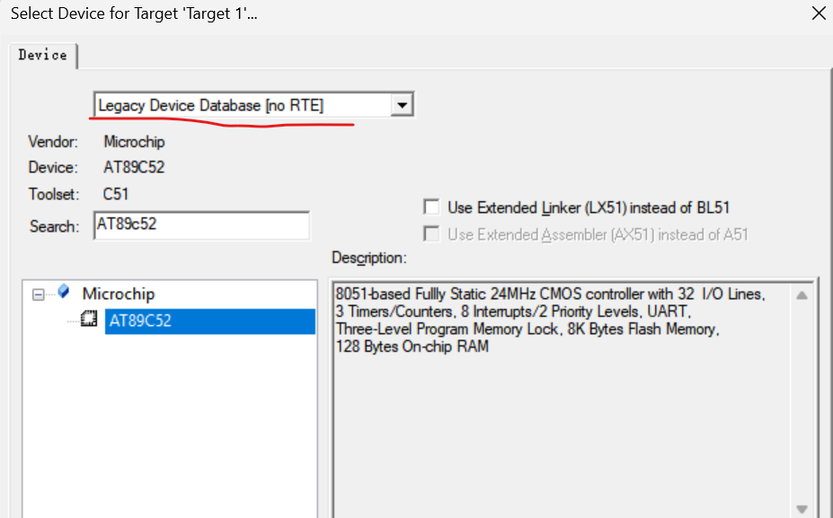
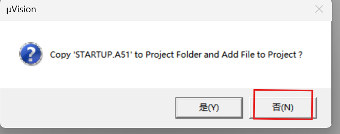
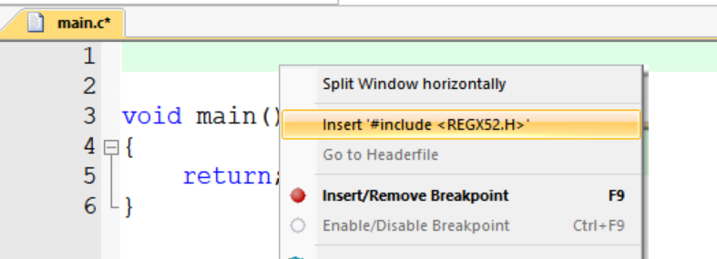
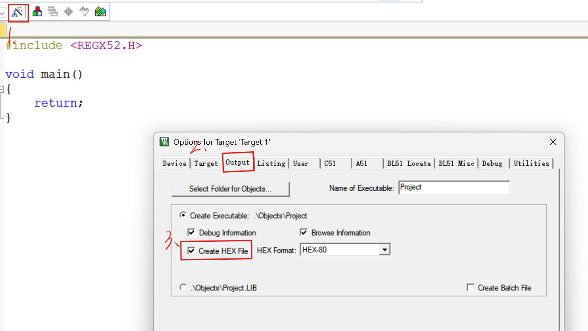
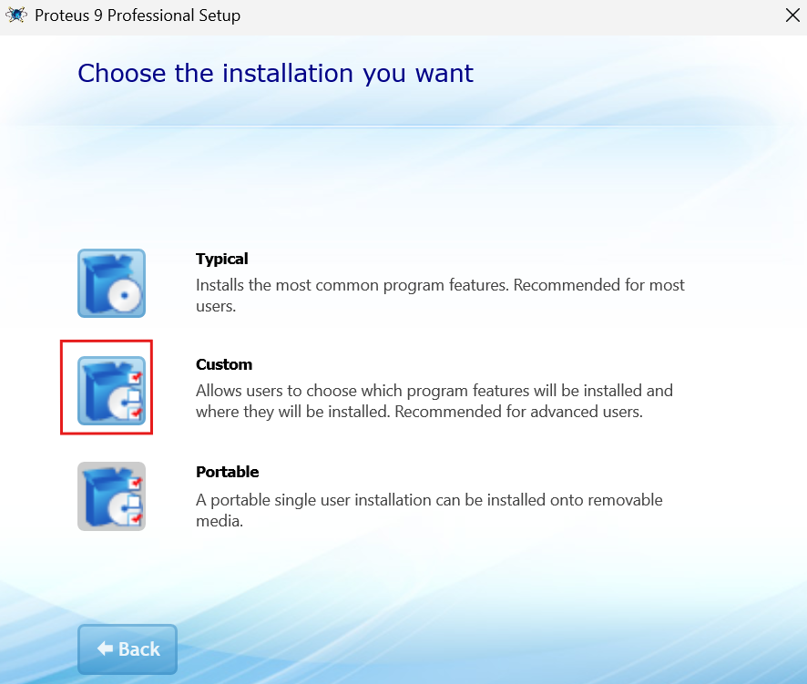
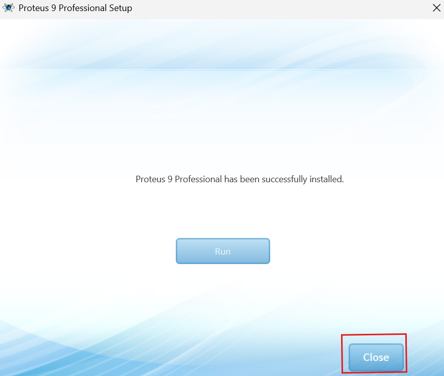
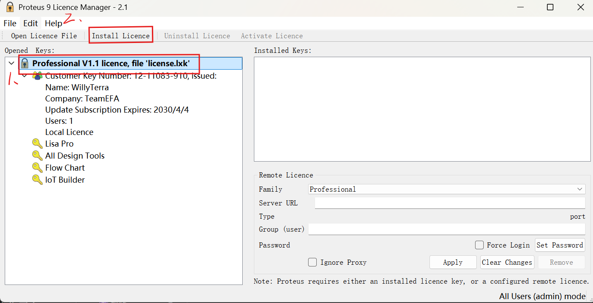

# 嵌入式入门认知
## 基本内容
1. **定义：** 为了完成某一个（或少数几个）特定功能，而嵌入到设备中的专用计算系统
  嵌入式并不是单独存在（不像电脑），而是”嵌入“在设备中，功能明确，包括芯片、软件、硬件等
     - 软件：裸机程序/RTOS/Embedded Linux、驱动层、应用逻辑
     - 硬件：包括芯片（MCU）、SoC、电源电路、传感器、通信接口（如UART、I2C、SPI、USB、CAN等）
2. **应用：** 涉及各个领域，可以理解为包括除电脑外的所有电子设备应用领域
   - **消费电子：** 电饭煲、微波炉、洗衣机、蓝牙智能手环等
   - **工业控制：** 变频器、PLC扩展模块、伺服驱动、工业机器人控制板
   - **机器人/智能车：** 电机控制、编码器测速、PID、传感器等
   - **物联网：** 智能家居、无线传感器节点、蓝牙设备等
   - **高端嵌入式：** 车载系统（如智能驾驶，包括了嵌入式+AI）、工业网关、医疗设备、嵌入式Linux设备
3. **MCU介绍：** 全称Microcontroller Unit，是CPU + 外设 + 存储 一体化芯片
   - 典型集成有
     - CPU（ARM Cortex-M）
     - Flash / SRAM
     - GPIO
     - 定时器
     - ADC/DAC
     - 串口、SPI、I2C、CAN、USB
   - 厂商：ST（STM32）、NXP、Microchip、TI（MSP4300）、以及一些国产厂商（如GD32、CH32）

## other
- **能力需求**（由低到高排序，越往下越难，需要注意由低到高进行能力培养，打好基础）
     - 电路基础+信号概念
     - C语言+**编程思想**（如面向对象、抽象分层以及一些基础算法）
     - MCU原理+**数据手册**
     - 驱动&外设控制
     - 应用逻辑（业务功能）
- **工程框架搭建：**
     - Core：为核心文件，会包括一些头文件、源文件、启动文件以及CMSIS相关文件
     - Driver：包含CMSIS库、驱动库（如HAL库、标准库等）、BSP（即板级支持包）和一些第三方驱动
     - Middlewares：通常会有一些中间件（如FreeRTOS）
     - system：系统层
     - **hardware：** 硬件驱动层，主要为自己编写的一些硬件驱动代码，如LED、蜂鸣器、电机等模块
     - **APP：** 应用层，负责业务逻辑和需求的实现，后续使用RTOS时还会包括任务管理
    >hardware和app目录中存放的业务逻辑有什么区别?

    >> **hareware** 职责主要是硬件驱动和抽象
    >>- 与具体硬件直接交互
    >>- 提供统一的硬件操作接口
    >>- 封装硬件差异

    >>**APP**职责主要是业务逻辑和功能实现
    >> - 实现具体产品功能
    >> - 协调多个硬件模块完成复杂任务
    >> - 处理用户逻辑和算法

- **编写驱动代码**
    可使用面向对象+抽象分层的方法，其主要分为四步
    - 硬件抽象层：负责与硬件沟通，只收发字节
    - 通信对象层：负责整合数据，管理状态
    - 协议对象层：负责拆包、校验数据，得到命令
    - 业务对象层：负责与单片机沟通，需要编写API接口、回调函数等方便被调用
---
## 个人目标
- 掌握数据结构的基本用法和常见操作
- 加深对于嵌入式相关底层的理解
---
# Keil
- 破解及安装见江科大的51单片机教程
## 新建空白工程
1. 在左上角点击新建工程，选择工程存放位置（建议新建文件夹来命名相关工程信息，工程名字设置为Project）
2. 选择对应的单片机型号（此处单片机型号stc89c52，由于无对应支持包，可选择AT89C52）
   - 若已经使用过stm32，需要在上面的方框中选择Legacy Device Database [no RTE]
3. 启动文件通常不需要更改，可选择否
4. 右键Target中的Source Group1可添加.c，此处通常命名为main
5. 在main.c文件中添加main函数并在文件顶端右键选择插入头文件
6. 点击魔术棒中的output，勾选Creat HEX File

7. 使用stc-isp将生成的.Hex文件下载到单片机（对应工具可在江科大提供的资料包中获取）
---
# Proteus
## 下载
[视频教程](https://www.bilibili.com/video/BV1dp421R7X9/?share_source=copy_web&vd_source=7044a8b37721f0d4a87d4b884b65e34a)
[安装包下载链接](https://www.shiyrj.top/) （迅雷没超会要下载好久。。。建议提前后台挂着下载）
### 9.0版本下载攻略！！！
9.0版本与教程中操作方式有一些不同
- 对于9.0版本，我们需要解压缩后**运行名为proteus9.0.SP2的应用程序文件**，这时候就会开始安装了（可能会要求下载Visual studio啥啥啥的，应该不下载也行）
- 注意这个界面要**选择Custom**（如果点击Typical会默认装在C盘！！！）
- **点击Close**，不要着急run起来哦（Be Water My Friend）
- 回到你安装包的文件夹，点击运行Crack中的Lisense Key，之后点击Install Lisense
- 然后把version.dll这个应用拓展移到**你的**安装目录(示例：D:\Program Files\Labcenter Electronics\Proteus 9 Professional\Bin)
- > 这里一定要多检查几遍有没有真的移成功，因为有时候防火墙没关，即使你移进去了也会被系统删除

然后你就可以愉快的Run辣！
欢迎来到仿真世界！

## 使用
[视频教程](https://www.bilibili.com/video/BV1NB4y1Q7tQ?vd_source=7044a8b37721f0d4a87d4b884b65e34a)
B站有很多资源，不再赘述
> 小tips：如果进去之后看不见元件库，可以尝试退出后选择以管理员身份运行
### 常用元器件
- 电阻：RES
- 电容：CAP
- 二极管：LED
- 51单片机：AT89C52
- 数码管：7SEG
- 按键：BUTTON
- LCD1602：
- 排针：RESPACK
---
# Git+GitHub
远程的代码托管+协作平台
[Git相关操作介绍](https://www.bilibili.com/video/BV1NtqbB7EVU/?vd_source=081bf5911dab27e105a8643e98c4dd11)
## 主要操作
- **仓库**：通常一个项目为一个仓库，README文档用于在建立仓库时给仓库中储存的项目进行基本信息的介绍，GitHub的历史版本为我们的push记录
- **分支**：默认主分支为main，分支可在不影响主线的情况下修改代码（如加一个新功能，可以测试能否正常运行）
- **相关操作**
  - 初始化仓库：**git init**
  - push：本地->GitHub **git push**（更常使用，git会默认push到你上一次push的仓库）
  - 或者指明路线，其中origin是默认远程仓库的名字（一个本地别名，和你实际的仓库名字无关，不需要对其进行修改），main是分支名（**git push origin main**）
  - pull：GitHub->本地 **git pull**
  - pull（同上）：**git pull origin main**
  - clone：将GitHub上的项目拉到本地（**git clone https://github.com/用户名/仓库名.git**）
  - 查看状态：用于查看哪些文件被修改、哪些文件未提交（**git status***）
  - 添加到暂存区（单文件：**git add main.c**  所有文件：**git add .**）
  - 提交代码：git commit -m "你想给这次提交写的介绍内容，我不鸡丢是什么啊,这个一定要写的哦"
  - 创建并切换分支（git checkout -b 你的分支名字）
  - 切换回主分支（git checkout main）（如果你的主分支名字是main的话）

- **最重要的！！！：.gitignore**
一个纯文本文件，放在仓库根目录（注意，其文件名字为.gitignore，没有后缀）用于告诉Git哪些文件/目录不需要被版本管理，写法规则见下
  - 忽略某个文件：main.hex(你想要忽略的文件名字)
  - 忽略某个目录：Debug/（Debug是你想要忽略的目录名字，/表示这是一个目录
  - 忽略某类文件：*.o 、*.elf 、*.hex
  - 反向规则：*.log    !important.lo（指的是忽略所有的.log，但保留important.log）
   > 针对cubemx生成keil编译的.gitignore文件示例
   >> ===== 编译输出 =====
   Debug/
   Release/
   build/
   *.o
   *.elf
   *.map
   *.hex
   *.bin
   *.lst
   ===== Keil / MDK =====
   *.uvprojx
   *.uvoptx
   *.uvgui.*
   *.scvd
   ===== CubeMX =====
   *.mxproject
   ===== VS Code =====
   .vscode/
   ===== 系统文件 =====
   .DS_Store
   Thumbs.db
## Other
### commit信息是乱码
！！含辛茹苦写的commit信息居然显示乱码
怎么破？
**原因**：你在vscode中的编码格式可能并不是UTF-8，但GitHub可不管（邪恶），它会默认以UTF-8的编码格式去解析信息，。。然后你的commit信息就寄了
**解决方案**：在终端中执行命令（该命令只修改commit信息的编码格式，不影响功臣中的其他代码）
```bash
git config --global i18n.commitEncoding utf-8
git config --global i18n.logOutputEncoding utf-8
git config --global core.quotepath false
```
### 修改之前的commit信息
- 不小心吧commit信息输错了怎么办？
1. 首先，输入下列命令，将git的默认编辑器变成vscode
   ```bash
   git config --global core.editor "code --wait"
   ```
2. 随后输入下列命令，你就可以进行更改了！ctrl+s即可保存，这个时候本地的commit信息就更改成功辣！
   ```bash
   git push --force-with-lease
   ```
3. 如果已经push到GitHub上了怎么办？！也可以通过运行下列命令解决，不过要小心哦，对于团队协作开发的项目这么做要慎重，但要是只有你自己看就无所谓啦
   ```bash
   git push --force-with-lease
   ```

---
# Markdowm
## 我的第一个markdowm笔记！！
anyway！**欢迎来到markdowm的世界**


## 正片开始！
**骗你的其实没开始**
在开始之前先贴一个链接，来自学习之神：菜鸟教程
超级适合菜鸟入门！！熟练后也可以当做字典来用，查一些不太常用导致遗忘的语法
- [菜鸟教程](https://www.runoob.com/)
- [markdown教程直通](https://www.runoob.com/markdown/md-tutorial.html)
- [视频教程-配置vscode环境](https://www.bilibili.com/video/BV1GoXQY3E2q?vd_source=7044a8b37721f0d4a87d4b884b65e34a)
- [语法讲解](https://www.bilibili.com/video/BV1bK4y1i7BY?vd_source=7044a8b37721f0d4a87d4b884b65e34a)（其实菜鸟教程中几乎都有）
>其实下面的都不用看 嘻嘻...
>>这是我为了提高markdowm语法的熟练度写的哈哈哈哈哈哈哈哈哈哈哈哈哈哈哈

## 下面是一些markdowm的常见语法
首先是
### 标题
如你所见，你只需要打出一个“井”号，并**输入一个空格**将其与文本内容隔开，就可以设置其为一级标题！
二级标题就输入两个“井”号，以此类推，建议按顺序使用分级标题，维持良好的标题结构
> 另外一种标题形式可见分割线中引用部分的介绍，即下文（嵌套这一块）
---
### 段落
- 实现段落有两种方式
  1. 你可以**在需要换行的末尾打两个以上的空格并回车**
  2. 在行末按两下回车（在.md文件中效果为空出一行）
- 以上两种方式都可以在预览或者导出PDF时显现出**换行的效果88（其实好像要求没那么严苛来着，有时候不这样做也可以看到换行的效果，不过为了不必要的麻烦还是尽量遵守一下Markdowm的语法规则吧。。）

---
### 引用块
你只需要打出一个“小于号”，即“<"，然后隔一个空格，你就可以书写引用块的内容辣！
> 记得**切换英文输入法**哦，否则你会惊喜的看见一个书名号哈哈哈哈哈哈哈哈哈哈哈哈哈哈哈（招笑，其实是因为我老是打出书名号）
你还可以进行**引用嵌套**，想要嵌套几层就输入几个“小于号”
>>哎我刚刚发现其实不用输入空格也可以识别为引用块的内容
咋写标题得打空格，不能和引用块一样呜呜呜呜
可惜
>我再试试要不要打空格
我靠还真不用
而且写**多行引用块只需要在第一行打小于号就可以了**
---
### 分割线
聪明的你应该能发现刚刚偷偷在上面展示分割线的用法了嘿嘿
没错！！！你**只需要输入三个减号“---”**
哎这里为什么不能连着用，还得多打一个空行，要不然就自动加大加粗了呜呜呜，我的三个减号输出的分割线也不见了
可惜
>我鸡丢了！

由于该语法，Markdowm将其转化为标题了
>> 想要复现自动加大加粗的现象，可以把这个引用块删除看看（（（
---
**或者三个星号“ *** ”**
***
或者**三个下划线“___"**
___
都可以打出分割线！
感觉怎么样哈哈哈哈哈哈哈
其实markdowm写起来确实蛮爽，不用动鼠标了！如果是小幅度的移动也可以搭配触控板来使用，爽爽爽！

---
### 图片
可以通过插件paste image直接粘贴图片，也可以使用更高级的HTML语言，这样可以更改图片的大小颜色等
>先占个位子，等我学会了HTML再回来写

---
### 链接
链接跳转对于笔记来说简直不要太重要！！！
其基本的语法格式为：**一对方框“[]”和一对小括号()**，方框里面是你想要输入的链接名称，我不鸡丢是什么啊，小括号中输入你想要跳转的链接，我也不鸡丢是什么啊！！！
> 依旧：**记得切换英文输入法**

---
### 表格
你的表哥来啦~~~~
语法格式如下：
|  表头   | 表头  |
|  ----  | ----  |
| 单元格  | 单元格 |
| 单元格  | 单元格 |

表格会使用“|“来分割不同的单元格，用四个减号来区分表头和正常的单元格

**注意！！！**
1. **表格前面不能有多余的缩进**
2. **第二行必须是“分隔线”，且每一列都要有 `---`**
