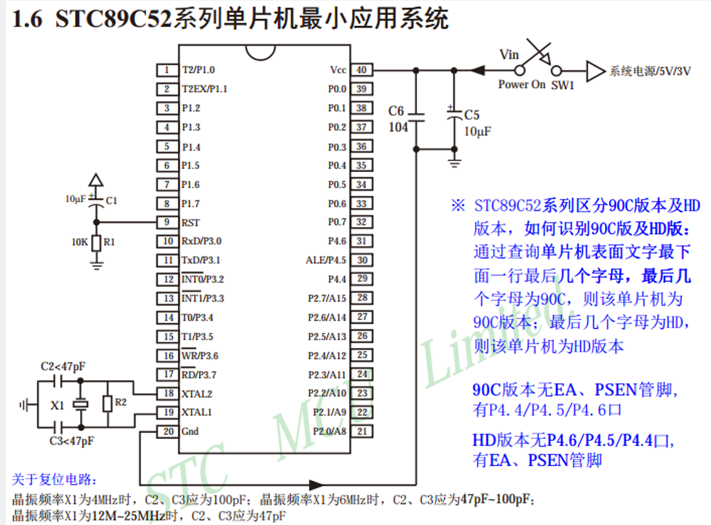
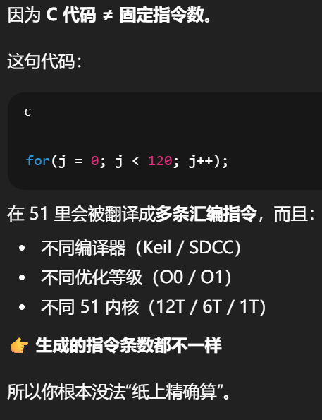

# 51单片机基础
数据手册：搜索STC89C52 Reference Manual
## 51单片机架构
- CPU（运算/控制）
  - 程序存储器（ROM / Flash）
  - 数据存储器（RAM）
  - 特殊功能寄存器（SFR）
  - 外设（IO / 定时器 / 串口 / 中断）
---
## 引脚定义
GPIO口的本质功能是控制引脚的输出输入，经典应用有输出高低电平、识别输入的高低电平等

- P0：GPIO开漏口，没有内部上拉，必须外接上拉电阻（即不可直接输出高电平），同时是外部存储器地址/数据复用总线（**AD0–AD7**）
- P1：经典GPIO口，有内部上拉，支持推挽输出
- P2：经典GPIO+**外部存储器高 8 位地址线**，其有内部上拉
- P3：GPIO+复用功能（如串口、中断等）
    | 引脚 |    复用功能    |
    | ---- | ------------- |
    | P3.0 | 串口接收 RXD   |
    | P3.1 | 串口发送 TXD   |
    | P3.2 | 外部中断0 INT0 |
    | P3.3 | 外部中断1 INT1 |
    | P3.4 | 定时器0 T0     |
    | P3.5 | 定时器1 T1     |
    | P3.6 | 外部写WR       |
    | P3.7 | 外部读RD       |

---
## 核心寄存器功能
1. A寄存器：累加器；B寄存器：配合A做乘除法

2. 工作寄存器：R0–R7，负责数据临时存哪

3. 程序执行控制寄存器
   - PC：程序计数器，指向下一条要执行的指令
   - SP：堆栈指针，指向当前栈顶位置（位于内部的RAM）负责告诉单片机程序走到哪了，调用了哪个函数

4. 状态寄存器
- PSW：程序状态字，记录运算结果状态 + 控制寄存器组（即告诉 CPU 现在用哪一套 R0–R7）

5. 特殊功能寄存器 SFR
   - IO 口寄存器（P0–P3）
   - 定时器相关寄存器（如TMOD：定时器模式、TH0/TL0：定时器初值、TCON：启停 / 溢出标志）
   - 中断控制寄存器（如IE：中断使能、IP：中断优先级）

---
## GPIO与延时函数
### GPIO
- GPIO输出：本质是**由引脚控制高低电平**
- 在使用GPIO控制LED闪烁时，需要注意给LED加上一个**限流电阻**，防止电流过大损坏GPIO口
    > 小tips：点亮LED通常使用**低电平点亮**
    原因：51单片机的灌入电流能力 > 拉高电流的能力，这样更稳定安全
---
### 延时函数
本质上是使用一些无意义的循环让**CPU空转**，达到延时的效果，这样实现延时简单粗暴，易于上手，但也有缺点：
- 浪费CPU的资源，这段时间单片机无法处理其他任务
- 会受到晶振频率的影响
#### 延时参数的计算逻辑
由于在51单片机中，**12个晶振周期 = 1个机器周期**（12分频架构），一个机器周期频率 = 11.0592 MHz / 12 ≈ 921.6 kHz，则周期 ≈ 1.085 μs。
若想要输入的参数为所需延时的时间（单位为ms）对于for循环：
```C
 unsigned int i, j;
    for(i = 0; i < ms; i++)
        for(j = 0; j < 120; j++);
```
我们希望内层的j执行一次循环耗时为1ms，**那这里为什么给出的内层循环参数为120呢？？？？**
！好问！兄弟好问！！
>其实120不是精确计算值，而是基于晶振频率+指令周期+编译器生成代码后的“经验校准值”（GPT如是说也）


---
## I/O 口批量控制方法
本质是对数据进行位操作，需要掌握按位与(&)、按位或(|)、位移(<<、>>)、按位异或（^）和按位取反（~）
### 一些常用小方法

---
## 按键与软件消抖动
- 原理：按键的内部其实是一个弹簧结构，当按下按键时，内部的弹簧依然会轻微抖动，这种轻微的抖动会造成输入电平的不稳定，被GPIO口检测到，需要一段时间后才能到达稳定的高/低电平状态。
- 软件消抖：为了消除这种影响，会使用**延时函数**，告诉单片机这段时间内忽略掉读取掉的电平，等一段时间过去电平稳定后再读取，这个时间通常设定为**20ms**