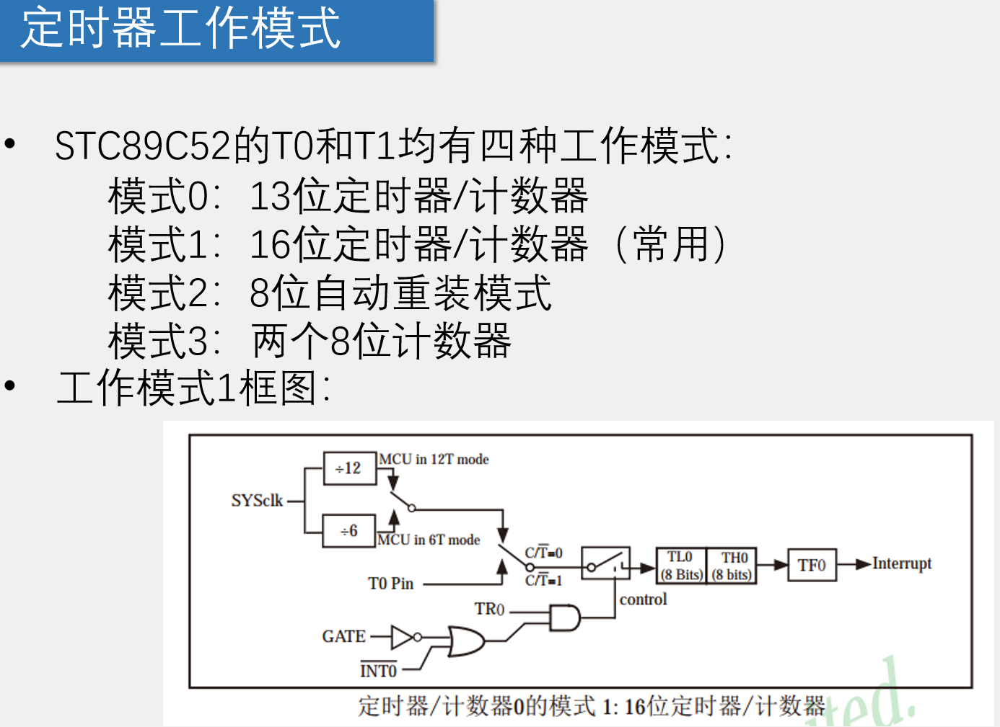
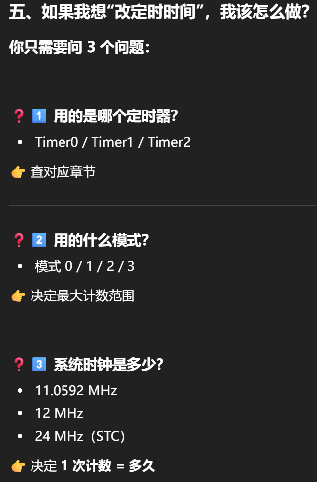

# 定时器与中断
## 定时器
### TMOD
定时器工作模式寄存器
```
结构
| GATE | C/T | M1 | M0 | GATE | C/T | M1 | M0 |
   T1                    T0
若TMOD |= 0x01;即Timer0中，
C/T = 0 -> 定时器（用系统时钟）；1 -> 计数器（外部输入）
M1 M0 = 01 -> 模式 1（16 位）
```

### TH0/TL0
TH0：Timer0 高 8 位计数器
TL0：Timer0 低 8 位计数器

TH0/TL0 → 向上计数 → 溢出 → 中断
告诉定时器从哪里开始数，多久之后溢出
> 对于下文中的TH0 = 0xFC;TL0 = 0x18;
> 表示定时器将会从0xFC18开始计数

### TCON
控制定时器运行状态 + 外部中断触发方式的寄存器
```
TCON是一个 8 位 SFR
┌────┬────┬────┬────┬────┬────┬────┬────┐
│TF1 │TR1 │TF0 │TR0 │IE1 │IT1 │IE0 │IT0 │
└────┴────┴────┴────┴────┴────┴────┴────┘
 bit7 bit6 bit5 bit4 bit3 bit2 bit1 bit0
```
#### TR0/TR1
定时器运放控制位： 1 -> 开始计数；0 -> 停止计数
#### TF0 / TF1
定时器溢出标志位，负责记录定时器是否有溢出

### Timer0使用模式的标准初始化流程
```C
/**
  * @brief  定时器0初始化，1毫秒@12.000MHz
  * @param  无
  * @retval 无
  */
void Timer0Init(void)
{
	TMOD &= 0xF0;		//设置定时器模式
	TMOD |= 0x01;		//设置定时器模式

	TH0 = 0xFC;		    //设置定时初值
	TL0 = 0x18;		    //设置定时初值

	TF0 = 0;		    //清除TF0标志
	TR0 = 1;		    //定时器0开始计时

	ET0=1;              //开启中断
	EA=1;               //允许任何中断打断
	PT0=0;              //设置定时器0的优先级高低
}
```

### 修改定时时间

初值 = 最大计数值 - 定时时间 / 计数周期

## 中断
### 中断优先级寄存器IP
全称Interrupt Priority Register
| 功能             | 控制寄存器         |
| -------------- | ------------- |
| 启动 / 停止 Timer0 | **TR0（TCON）** |
| 允许 Timer0 中断   | **ET0（IE）**   |
| 允许所有中断         | **EA（IE）**    |
| Timer0 中断优先级   | **PT0（IP）**   |


### 中断允许寄存器IE
```
IE.7   IE.6   IE.5   IE.4   IE.3   IE.2   IE.1   IE.0
 EA     -      -     ES     ET1    EX1    ET0    EX0
```
| 位号   | 名称      | 作用          |
| ---- | ------- | ----------- |
| IE.7 | **EA**  | 总中断允许       |
| IE.1 | **ET0** | Timer0 中断允许 |
| IE.3 | ET1     | Timer1 中断允许 |
| IE.4 | ES      | 串口中断允许      |
| IE.0 | EX0     | 外部中断 0      |
| IE.2 | EX1     | 外部中断 1      |
